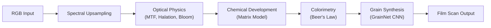
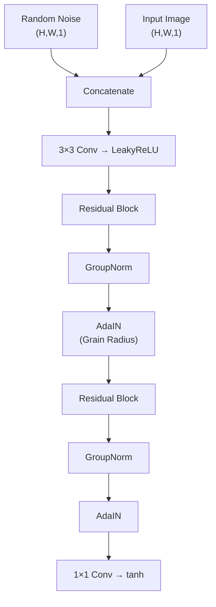

# Complete Scientific Walkthrough: Film Emulation Pipeline

This document provides an ultra-detailed analysis of all the science—**data, models, math, and physics**—used in this photographic film emulation pipeline.

---

## Pipeline Overview

The pipeline simulates the complete photochemical process of motion picture film:



---

## Module I: Spectral Upsampling (RGB → SPD)

> **Files**: [spectral_upsampler.py](file:///home/praneeth-merugu/Projects/Film/core/upsampler/spectral_upsampler.py), [generate_lut.py](file:///home/praneeth-merugu/Projects/Film/core/upsampler/generate_lut.py)

### Physics Concept

Film emulsions are sensitive to specific wavelengths, not RGB channels. To accurately model halation and exposure, the pipeline **reconstructs a 64-bin Spectral Power Distribution (SPD)** from each RGB pixel spanning **360–830 nm**.

### Mathematical Model: Jakob 2019 Polynomial Parameterization

The spectrum is parameterized by a **second-degree polynomial through an algebraic sigmoid**:

$$
\text{SPD}(\lambda) = \sigma\left( A \cdot w^2 + B \cdot w + C \right)
$$

Where:
- $w = \frac{2(\lambda - 360)}{470} - 1$ is the normalized wavelength in $[-1, 1]$
- $\sigma(x) = \frac{1}{2}\left(\frac{x}{\sqrt{1+x^2}} + 1\right)$ is the **algebraic sigmoid** (smooth, bounded to $(0,1)$)

> [!NOTE]
> This sigmoid was chosen over the standard exponential sigmoid because its infinite differentiability enables robust gradient-based optimization.

### Color Matching Functions: Wyman 2013 Analytic CMFs

The CIE 1931 2° XYZ Color Matching Functions are approximated analytically using **asymmetric Gaussian lobes**:

$$
\bar{x}(\lambda) = \text{lobe}(\lambda, 1.056, 599.8, 37.9, 31.0) + \text{lobe}(\lambda, 0.362, 442.0, 16.0, 26.7) + \ldots
$$

Where:
$$
\text{lobe}(\lambda, A, \mu, \sigma_1, \sigma_2) = A \cdot \exp\left(-\frac{1}{2}\left(\frac{\lambda - \mu}{\sigma}\right)^2\right), \quad \sigma = \begin{cases} \sigma_1 & \lambda < \mu \\ \sigma_2 & \lambda \geq \mu \end{cases}
$$

### D65 Illuminant Calibration

The **Effective CMF** combines the CMF with the D65 illuminant SPD and normalizes to standard white point coordinates:

$$
\bar{x}_{\text{eff}}(\lambda) = \bar{x}(\lambda) \cdot I_{D65}(\lambda) \cdot \frac{0.95047}{\sum \bar{x} I_{D65}}
$$

This ensures that a flat 1.0 reflector integrates to exact **D65 XYZ** values expected by the **Rec. 709 XYZ→RGB matrix**.

### LUT Generation: Levenberg-Marquardt Optimization

For each RGB point in a 32³ grid, coefficients $(A, B, C)$ are found via **multi-start Levenberg-Marquardt** optimization. The solver uses an expanded set of initial guesses to robustly capture the gamut boundaries (pure saturated colors):

| Initial Guess Strategy | $[A, B, C]$ (Approx) | Purpose |
|------------------------|----------------------|---------|
| **Achromatic** | $[0, 0, 0]$ | Grey/Neutral tones |
| **Bias Up** | $[0, 0, 0.8]$ | High luminance/White |
| **Red** | $[0, 20, -10]$ | Steep positive slope |
| **Blue** | $[0, -20, 10]$ | Steep negative slope |
| **Green** | $[-25, 0, 10]$ | Parabola opening down |
| **Magenta** | $[25, 0, -10]$ | Parabola opening up |

The loss function includes a **weighted regularization term** to favor smoothness without penalizing the large coefficients needed for saturated colors:

$$
\mathcal{L}(A,B,C) = \|RGB_{\text{target}} - RGB_{\text{pred}}\|_2^2 + \sum \{A^2, B^2, C^2\} \cdot \vec{w}_{\text{reg}}
$$

Where $\vec{w}_{\text{reg}} = [10^{-7}, 10^{-8}, 10^{-9}]$. This tiny regularization prevents parameter drift in flat areas while allowing the necessary curvature for spectral peaks.

---

## Module II: Spectral Exposure Calculation

> **File**: [exposure.py](file:///home/praneeth-merugu/Projects/Film/core/expose/exposure.py)

### Physics Concept: Actinic Exposure

**Actinic exposure** is the amount of photographically-effective light reaching each emulsion layer. It depends on the spectral sensitivity of the silver halide crystals:

$$
H_c = \int_\lambda L(\lambda) \cdot S_c(\lambda) \, d\lambda
$$

Where:
- $L(\lambda)$: scene spectral radiance
- $S_c(\lambda)$: spectral sensitivity of layer $c \in \{R, G, B\}$

### Data Source: Kodak Vision3 250D Datasheets

The sensitivity curves are loaded from:
- `Red_log_ssf.csv`, `Green_log_ssf.csv`, `Blue_log_ssf.csv`

These contain **log₁₀ sensitivity** values which are converted to linear:

$$
S_{\text{linear}}(\lambda) = 10^{S_{\log}(\lambda)}
$$

### Implementation

The discrete integration is a simple dot product over the 64 wavelength bins:

```python
actinic_exposure = jnp.dot(spectral_image, sensitivities.T)  # (H,W,64) @ (64,3) → (H,W,3)
```

---

## Module III: Optical Physics (The "Sandwich" Model)

> **File**: [scattering.py](file:///home/praneeth-merugu/Projects/Film/core/optical/scattering.py)

### Physics Concept: Spectral-First Layer Separation

Unlike simpler models that bloom RGB directly, this pipeline simulates the physical structure of film layers **before** scattering occurs.

1.  **Spectral Integration**: The continuous SPD is integrated against the specific spectral sensitivity functions ($S_B(\lambda), S_G(\lambda), S_R(\lambda)$) to create three separate **Exposure Maps** ($E_R, E_G, E_B$) representing the latent image contribution of each layer.
2.  **The "Sandwich" Optical Cascade**:
    Light scattering is modeled sequentially to respect the physical location of the filtering layers (e.g., the Yellow Filter between Blue and Green/Red layers).

### The Multi-Pass Scattering Model

#### Pass 1: Top Layer (Blue) Bloom
Blue light hits the top layer first and scatters immediately.

$$
E_B^{\text{bloom}} = E_B * \text{PSF}_{\text{Lorentzian}}
$$

#### Pass 2: Yellow Filter Attenuation
Before blue light can reach the lower layers, it must pass through the **Yellow Filter** (Carey Lea Silver). This filter absorbs blue light to prevent it from exposing the Green/Red layers or causing "Blue Halation" rings.

$$
E_B^{\text{filtered}} = E_B^{\text{bloom}} \times (1.0 - \text{Absorbance}_{\text{Yellow}})
$$

#### Pass 3: Deep Bloom (Green + Red + Filtered Blue)
The Green and Red layers sit below the filter. They receive the scene's Green/Red light *plus* the attenuated Blue light that punched through the filter. This combined light scatters together in the emulsion bulk.

$$
E_{\text{deep}} = E_G + E_R + E_B^{\text{filtered}}
$$

$$
E_{\text{deep}}^{\text{bloom}} = E_{\text{deep}} * \text{PSF}_{\text{Lorentzian}}
$$

#### Pass 4: Spectral Halation (Reflection)
Halation occurs when light reaches the acetate base and reflects back. The source of this reflection is the fully scattered "Deep" light.

$$
H = E_{\text{deep}}^{\text{bloom}} * \text{PSF}_{\text{GaussianRing}} \times \text{Gain}
$$

### Reconstruction
The final Latent Image is reconstructed, with Halation added primarily to the Red channel (as red light travels furthest and back-scatters most efficiently).

$$
\text{Latent} = \text{Stack}(E_B^{\text{bloom}}, E_G^{\text{deep\_bloom}}, E_R^{\text{deep\_bloom}}) + \vec{v}_{\text{hal}} \cdot H
$$

This ensures that **Blue highlights bloom (Pass 1) but do not cause Red Halation rings (Pass 2)**, creating a physically accurate "Glow vs. Ring" separation.

---

## Module IV: Sensitometric Tone Mapping (H&D Curve)

> **File**: [tone_curve.py](file:///home/praneeth-merugu/Projects/Film/core/sensitometry/tone_curve.py)

### Physics Concept: The Hurter-Driffield Characteristic Curve

The H&D curve relates **log exposure** to **optical density**. It captures:
- **Toe**: Shoulder region at low exposure (D-min, fog level)
- **Linear region**: Proportional response (gamma/contrast)
- **Shoulder**: Saturation at high exposure (D-max)

### Mathematical Model: Generalized Logistic Function (Richards' Curve)

$$
D(h) = D_{\min} + \frac{D_{\max} - D_{\min}}{\left(1 + \exp(-k(h - h_0))\right)^\nu}
$$

| Parameter | Physical Meaning |
|-----------|-----------------|
| $D_{\min}$ | Minimum density (fog + base) |
| $D_{\max}$ | Maximum density (saturation) |
| $k$ | Slope (gamma/contrast) |
| $h_0$ | Speed point (ISO/ASA) |
| $\nu$ | Asymmetry factor |

> [!IMPORTANT]
> The asymmetry parameter $\nu$ distinguishes this from a standard logistic curve and models the different rolloff rates of toe vs. shoulder regions.

### Curve Fitting: Levenberg-Marquardt via Optimistix

Parameters are fit to Kodak's published H&D data (`*_d_log_e.csv`) using **nonlinear least squares**:

$$
\min_{\theta} \sum_i \left( D_{\text{pred}}(h_i; \theta) - D_{\text{actual}}(h_i) \right)^2
$$

Parameters are transformed to enforce physical constraints:
- $D_{\min} = \sigma(\theta_0) \cdot 0.5$ (bounded to $[0, 0.5]$)
- $D_{\max} = 1.5 + \text{softplus}(\theta_1)$ (bounded to $[1.5, \infty]$)
- $k, \nu = \text{softplus}(\cdot)$ (positive)

---

## Module V: Chemical Development (Non-Linear Matrix Model)

> **File**: [matrix.py](file:///home/praneeth-merugu/Projects/Film/core/chemical/matrix.py)

### Physics Concept: "Organic" Adjacency Effects

This module approximates the complex reaction-diffusion kinetics of the development tank. It has been upgraded to include **non-linear exhaustion** and **directional drag**.

### The Spatially Variant Linear-Spatial (SVls) Model

#### 1. Directional Diffusion (Bromide Drag)
Diffusion kernels are modeled as **Elliptical Gaussians** to simulate the physical movement of the film through the chemical bath.

$$
G_{\sigma}(x,y) \propto \exp\left(-\frac{x^2}{2\sigma_x^2} - \frac{y^2}{2\sigma_y^2}\right)
$$

By setting $\sigma_y > \sigma_x$ (using `drag_ratio`), we simulate **vertical bromide drag**, creating subtle vertical streaks from high-density areas.

#### 2. Dynamic Inhibitor Field
The inhibitor field is interpolated between "Hard" (Highlight) and "Soft" (Shadow) diffusion states, modulated by the Tanning Mask $M(x)$:

$$
I_{\text{linear}} = M(x) \cdot (D_{\text{macro}} * G_{\sigma_{\text{hard}}}) + (1 - M(x)) \cdot (D_{\text{macro}} * G_{\sigma_{\text{soft}}})
$$

#### 3. Sigmoidal Exhaustion
In regions of extreme density, the developer chemicals become locally exhausted, limiting the maximum possible inhibition. This is modeled by a sigmoid function:

$$
I_{\text{exhausted}}(x) = \frac{1}{1 + \exp(-\alpha \cdot (I_{\text{linear}}(x) - \beta))}
$$

This prevents unnatural "black halos" around extremly bright sources by soft-clipping the inhibition strength.

#### 4. Chemical Coupling Matrix (Diagonal)
To avoid **Double-Counting Crosstalk**, the default coupling matrix is **Diagonal**:

$$
\mathbf{K} = \begin{bmatrix} k_{rr} & 0 & 0 \\ 0 & k_{gg} & 0 \\ 0 & 0 & k_{bb} \end{bmatrix}
$$

Since the input Sensitometric Curves (D-logE) already capture the global dye crosstalk and inter-layer separation of the calibrated stock, we use this matrix *only* for spatial adjacency effects (Sharpening/Bloom), not for color correction.

---

## Module VI: Colorimetric Transformation (Beer's Law)

> **File**: [dye_densities.py](file:///home/praneeth-merugu/Projects/Film/core/color/dye_densities.py)

### Physics Concept: Subtractive Dye Mixing

Film negatives use **CMY dyes** that absorb light:
- **Cyan dye** absorbs Red → produced by Red-sensitive layer
- **Magenta dye** absorbs Green → produced by Green-sensitive layer
- **Yellow dye** absorbs Blue → produced by Blue-sensitive layer

### Mathematical Model: Beer-Lambert Law

The **integral density** (what a scanner sees) is the linear combination of dye absorptions:

$$
\begin{bmatrix} D_R \\ D_G \\ D_B \end{bmatrix} = \mathbf{M} \begin{bmatrix} C \\ M \\ Y \end{bmatrix} + \begin{bmatrix} D_{R,\text{base}} \\ D_{G,\text{base}} \\ D_{B,\text{base}} \end{bmatrix}
$$

Where $\mathbf{M}$ is the **3×3 mixing matrix**:

$$
\mathbf{M} = \begin{bmatrix} C_R & M_R & Y_R \\ C_G & M_G & Y_G \\ C_B & M_B & Y_B \end{bmatrix}
$$

Each column represents the **spectral density profile** of one dye sampled at Status M wavelengths (650nm, 550nm, 450nm).

### Data Sources

- `cyan_density.csv`, `magenta_density.csv`, `yellow_density.csv`: Spectral absorption curves
- `minimum_density.csv`: Orange mask + fog (D-min)

### Unwanted Absorptions (Cross-Talk)

Real dyes are **imperfect**:
- Magenta dye has unwanted absorption in Blue
- Cyan dye has unwanted absorption in Green

The mixing matrix captures these cross-couplings, which are essential for accurate negative color rendering.

---

## Module VII: Film Grain Synthesis (GrainNet)

> **Files**: [core.py](file:///home/praneeth-merugu/Projects/Film/core/grainnet/core.py), [model.py](file:///home/praneeth-merugu/Projects/Film/core/grainnet/model.py)

### Physics Concept: Silver Halide Grain Structure

Film grain is the visible structure of developed silver (negative) or dye clouds (positive). It exhibits:
- **Random spatial distribution**
- **Density-dependent size** (larger grains in highlight areas)
- **Texture correlation** (grains cluster)

### Model Architecture: Conditional Generative CNN

GrainNet is a **convolutional neural network** (implemented in Flax/Equinox) that learns to synthesize realistic grain. It is configurable (defaulting to **2 residual blocks**) and generates grain based on:
1. Input noise tensor
2. Base image density
3. Grain radius parameter (controls grain size/strength)



### Key Components

#### Residual Blocks
Standard skip-connection blocks with **LeakyReLU** (slope=0.01) and **GroupNorm**:

$$
\text{output} = \text{LeakyReLU}(\text{Conv2}(\text{LeakyReLU}(\text{Conv1}(x))) + x)
$$

#### Adaptive Instance Normalization (AdaIN)

The **grain radius** parameter modulates the network via learned affine transforms in the `MyNorm` layers:

$$
\text{MyNorm}(x, r) = x \cdot \sigma(r) + \mu(r)
$$

Where $\sigma(r)$ and $\mu(r)$ are learned dense projections of the grain radius parameter.

> [!TIP]
> This allows a single model to generate grain at any strength by varying the conditioning parameter, rather than training separate models per grain size.

#### Output Activation

The final layer uses **tanh scaled to [0,1]**:

$$
\text{output} = \text{clip}\left(\frac{\tanh(x) + 1}{2}, 0, 1\right)
$$

---

## Module VIII: Final Compositing

> **File**: [pipeline.py](file:///home/praneeth-merugu/Projects/Film/pipeline.py)

### Density to Transmittance Conversion

The final film scan converts density back to linear light (transmittance):

$$
T = 10^{-D}
$$

This is the standard densitometry formula relating optical density to transmittance.

---

## Data Sources

All empirical data comes from Kodak Vision3 250D datasheets:

| File | Content | Use |
|------|---------|-----|
| `*_log_ssf.csv` | Log spectral sensitivity | Actinic exposure calculation |
| `*_d_log_e.csv` | H&D characteristic curves | Tone mapping curve fitting |
| `cyan/magenta/yellow_density.csv` | Spectral dye densities | Colorimetric mixing matrix |
| `minimum_density.csv` | Base + fog density | Orange mask correction |

---

## Mathematical Notation Summary

| Symbol | Meaning |
|--------|---------|
| $\lambda$ | Wavelength (nm) |
| $L(\lambda)$ | Spectral radiance |
| $S_c(\lambda)$ | Spectral sensitivity of layer $c$ |
| $H$ | Exposure (lux-seconds) |
| $h$ | Log exposure ($\log_{10} H$) |
| $D$ | Optical density ($-\log_{10} T$) |
| $T$ | Transmittance |
| $\sigma_{soft/hard}$ | Diffusion radii (Soft/Hard gelatin) |
| $K$ | Coupling Matrix |

---

## Physical Constants

| Constant | Value | Source |
|----------|-------|--------|
| Wavelength range | 360–830 nm | CIE visible spectrum |
| Wavelength bins | 64 | Resolution tradeoff |
| D65 white point (XYZ) | [0.95047, 1.0, 1.08883] | CIE standard |
| Yellow filter cutoff | 540 nm | Vision3 anti-halation layer |
| Status M wavelengths | [650, 550, 450] nm | Densitometry standard |

---

## References

1. **Jakob & Hanika 2019**: "A Low-Dimensional Function Space for Efficient Spectral Upsampling" – Polynomial parameterization with algebraic sigmoid
2. **Wyman, Sloan, Shirley 2013**: "Simple Analytic Approximations to the CIE XYZ CMFs" – Asymmetric Gaussian CMF model
3. **Friedman & Ross**: Theory of reaction-diffusion edge effects in photographic development
4. **Spatially Variant Matrix Model**: Standard technique for efficient chemical emulation
4. **Hurter & Driffield 1890**: Founding work on characteristic curves (H&D curves)
5. **Beer-Lambert Law**: Foundation of spectral absorption and dye density
6. **Kodak Vision3 250D Technical Data**: Empirical sensitometry and dye density curves
